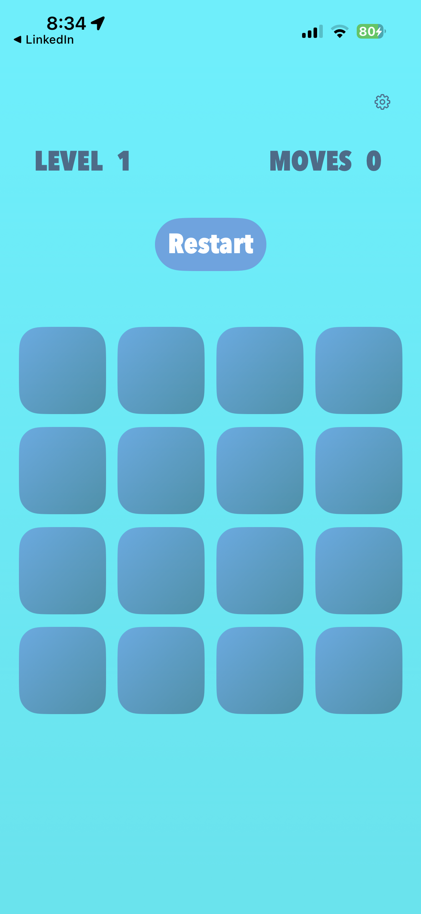
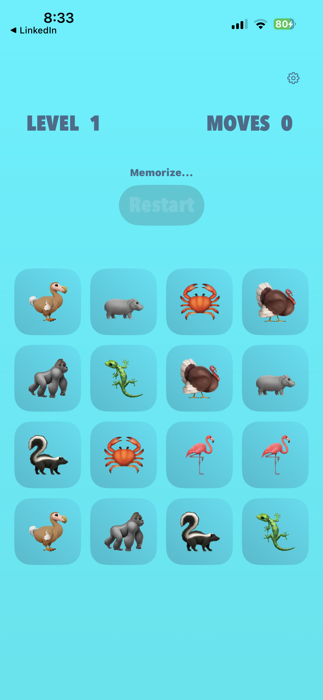

# Flipside

Flipside is a fast-paced emoji memory game built with SwiftUI.

Flip tiles, match emoji pairs, and clear the board in as few moves as possible. Each level starts with a short preview, then tiles flip back and the memory challenge begins.

## Features

- 4x4 memory grid with increasing levels
- Emoji-based tile sets (food, animals, fruits, zodiac signs)
- Haptic feedback for mismatches and level-up events
- Move counter and level tracker
- Theme selection screen

## Screenshots

